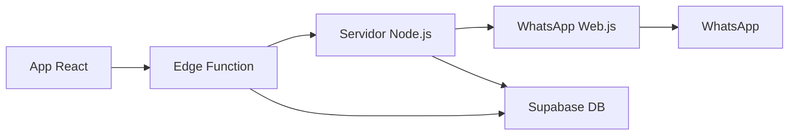

# 🚀 Configuração do Servidor WhatsApp

## ⚠️ IMPORTANTE

Para usar o WhatsApp real (não simulado), você precisa rodar um **servidor Node.js separado** que gerencia a conexão com o WhatsApp Web.

## 📋 Requisitos

- Node.js 16+
- npm ou yarn
- VPS ou servidor com IP público (para produção)
- Chrome/Chromium instalado

## 🔧 Instalação Rápida

### 1. Criar pasta do servidor

```bash
mkdir whatsapp-server
cd whatsapp-server
```

### 2. Inicializar projeto Node.js

```bash
npm init -y
npm install express cors whatsapp-web.js qrcode @supabase/supabase-js jsonwebtoken
```

### 3. Criar arquivo do servidor

Copie o código de `docs/whatsapp-server/server.js` para `whatsapp-server/server.js`

### 4. Configurar variáveis de ambiente

Crie `.env`:

```env
SUPABASE_URL=https://wmoylybbwikkqbxiqwbq.supabase.co
SUPABASE_SERVICE_ROLE_KEY=sua_service_role_key
PORT=8787
```

### 5. Executar servidor

```bash
node server.js
```

## 🌐 Deploy em Produção

### Opção 1: Railway

```bash
# 1. Instalar Railway CLI
npm install -g @railway/cli

# 2. Login
railway login

# 3. Criar projeto
railway new

# 4. Deploy
railway up
```

### Opção 2: Render

1. Conectar repositório ao Render
2. Configurar build command: `npm install`
3. Configurar start command: `node server.js`
4. Adicionar variáveis de ambiente

### Opção 3: VPS/DigitalOcean

```bash
# 1. Instalar PM2
npm install -g pm2

# 2. Iniciar com PM2
pm2 start server.js --name "whatsapp-server"

# 3. Salvar configuração
pm2 save
pm2 startup
```

## 📱 Como Conectar WhatsApp

1. **Inicie o servidor** (local ou produção)
2. **Acesse a aplicação** no navegador
3. **Vá para WhatsApp > Conexão**
4. **Clique em "Conectar"**
5. **Escaneie o QR Code** com seu WhatsApp
6. **Aguarde a confirmação**

## 🔄 Fluxo de Funcionamento



## 🐛 Troubleshooting

### Erro: "Servidor WhatsApp não disponível"

- ✅ Verifique se o servidor Node.js está rodando
- ✅ Confirme a URL em `WHATSAPP_SERVER_URL`
- ✅ Verifique logs do servidor

### Erro: "WhatsApp não conectado"

- ✅ Escaneie o QR Code novamente
- ✅ Verifique se o WhatsApp está ativo no celular
- ✅ Reinicie o servidor se necessário

### Contatos não aparecem

- ✅ Aguarde alguns segundos após conectar
- ✅ Verifique se tem contatos no WhatsApp
- ✅ Reinicie a aplicação

## 🔗 URLs importantes

- **Local**: `http://localhost:8787`
- **Produção**: Substitua `WHATSAPP_SERVER_URL` na edge function

## 📞 Suporte

Para problemas específicos:

1. Verifique logs do servidor Node.js
2. Verifique logs da Edge Function no Supabase
3. Teste conexão manual: `curl http://seu-servidor/status`

---

💡 **Dica**: Para desenvolvimento, use ngrok para expor o servidor local:

```bash
npx ngrok http 8787
```